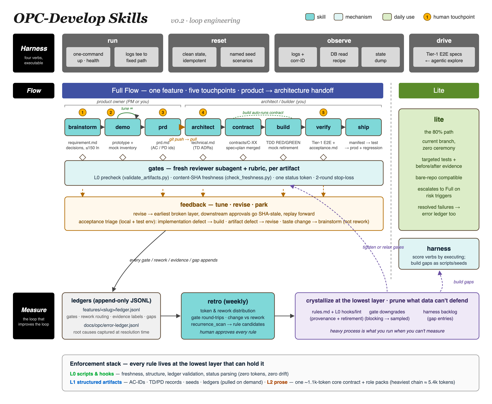

# opc-develop

[English](README.md)

opc-develop 是一套面向 AI 辅助产品开发的 Claude Code / Codex skill 套件，为那些亲自对项目的
产品判断、设计品味和工程品味负责的 Builder 而打造。它把你的品味沉淀为三份产物
（requirement、PRD + demo、技术设计），把执行交给受机械化门禁约束的 agent——并且不同于
多数 workflow 套件，它会**度量自己的闭环**，让流程随着数据的支撑而逐步收缩。



## 亮点

- **用三层嵌套反馈闭环取代前置堆砌的散文。** 任务级证据（TDD RED/GREEN、证据三角）、
  feature 级门禁（喂入 rubric 的全新 reviewer、基于内容 SHA 的新鲜度检查）、
  闭环级度量（`retro` 挖掘账本并提出改进建议）。
- **Demo 先行：数据是假的，感觉是真的。** 在写任何 PRD 之前，先在真实前端代码库里做出
  高保真原型——品味靠体验验证，而不是靠阅读。每个 mock 在创建时即登记入册，在完成前
  全部退役，最后还有一次残留审计。
- **AC-ID 主线。** PRD 验收标准只编号一次，之后由技术设计、实现契约、E2E 规格、评审和
  验收清单引用——绝不复述。
- **诚实的证据，始终带标签。** 每条验证结论都带真实性标签（`mock passed` →
  `seeded passed` → `local real service passed` → `external provider passed` →
  `human accepted` → `long-run passed`）。harness 能力缺失只会封顶可达到的标签等级，
  绝不会悄悄升级结论。
- **机械化门禁，而非口头劝诫。** 评审新鲜度是一次 `git hash-object` 比较
  （`check_freshness.py`），产物结构由脚本检查（`validate_artifacts.py`），账本写入经过
  schema 校验（`opc_ledger.py`），状态令牌由机器解析。全部是标准库 Python，全部有测试覆盖。
- **架构层面的 token 精简。** 一份始终加载的核心契约（约 1.1k token），加上按需拉取的
  角色规则包。最重的调用链（build）约 5.4k 框架 token——大约是同类重门禁套件的四分之一。
- **有治理的自我演化。** 已解决的失败会把根因追加到错误账本；`retro` 检测重复出现的问题，
  并在最低的约束层提出规则（lint/hook 优先，散文最后）——每条规则都需要人类批准、
  记录出处，并接受退役复审。
- **默认放行，记录缺口。** 缺失的 runbook、服务或 subagent 支持会诚实降级
  （记录缺口 + 封顶标签），而不是阻塞。裸仓库也能工作，包括 lite 路径。只有破坏性操作
  ——部署、force-push、删除、对外发布——默认拦截。

## 适合人群

opc-develop 为 Builder 而建，尤其是 OPC（一人公司）创始人和独立经营者——他们能自己判断
一个需求在结构上是否成立、一个交互感觉是否对、一个架构是否经得起时间。这套套件保护的是
这些判断，而不是代替它们。

**它不适合**纯实现类角色，也不适合难点在于团队协调和路线图谈判的工作。套件刻意把人类
注意力集中在五个决策点上；如果你无法在这些点上判断产品结构或架构深度，这套 workflow
会让你觉得苛刻，而不是省心。

## 运行理念

人类始终对上下文、品味、产品结构和架构方向负责。方向足够清晰之后，执行交给 agent——
同时闭环本身被埋点度量，你能看清 token、返工和重复错误究竟去了哪里。

预期的运行闭环：

0. **先让项目变得可读。** 运行 `harness` 为四个动词打分并补齐——*run*（一条命令启动
   整套栈 + 日志写到固定路径）、*reset*（幂等的干净状态 + 具名 seed 场景）、*observe*
   （带关联 ID 的结构化日志、只读数据库查询配方、状态导出）、*drive*（已提交的 Tier-1
   E2E 规格，由 agent 探索式编写）。能力评分靠实际执行，绝不靠阅读文档。
1. **把原始想法交给 agent，让它拷打你**（`brainstorm`）。一次一个问题，每个问题都附
   推荐答案，直到想法变成一份不超过 150 行、决策先行的 `requirement.md`，包含领域语言、
   非目标、权衡、风险画像和验收信号——并落在自己带编号的 feature 分支上。
2. **先体验，再规格化**（`demo`）。agent 在真实前端里（非 UI feature 则是可运行的骨架）
   基于纯前端 mock 构建原型。你反复把玩；tune 循环免费且不限次数。此处便宜的 `revise`
   胜过日后昂贵的返工。
3. **签署产品决策清单**（`prd`）。产品负责人——PM，或独立作战的你——把体验过的 demo
   转化为带编号 AC 和 PD 决策记录的 PRD，签署决策清单，并推送 feature 分支作为交接。
4. **先做 intake，再签署架构决策清单**（`architect`）。架构师拉取分支，先做 intake
   （先理解再设计；疑问以 `revise` 形式路由回产品负责人，绝不自行作答），执行风险
   spike，在 ADR 风格的 TD 记录中承诺唯一路线，并对所有标记 `[ONE-WAY]` 的决策显式
   批准。有争议的选择必须带着选项、权衡、推荐、可逆性和推迟成本一起出现——否则根本
   不该出现。
5. **放心交接执行**（`build`，会先自动运行 `contract`）。工作被切分成自足的实现契约
   （以冷读者可构建性设门禁）；实现者 subagent 以 TDD 推进并留存 RED/GREEN 证据；
   每份契约都通过一次合并的合规 + 质量评审；`verify` 为每条 AC 组装证据三角
   （接口断言 + 关联 ID 日志链 + 状态断言），并把每项重要检查蒸馏成一份已提交的规格。
6. **验收、发布、度量**（`verify` 触点 → `ship` → `retro`）。你评判一份每条 AC 一行、
   带诚实标签的验收清单。`ship` 运行分阶段发布流水线：变更清单（DDL、环境变量、配置
   ——从 diff 收集，并对照 technical.md 设门禁）→ 测试环境部署 → 测试验收 →
   回滚就绪前提下的生产发布 → 线上回归。任何一次验收中的驳回都会分诊为实现缺陷、
   产物缺陷和品味变化。`retro` 每周收束闭环：token 去了哪里、哪些门禁配得上成本、
   哪些错误在重复。

## 反馈模型

每个触点上的所有人类反馈都归入且仅归入以下一类：

| 类别 | 含义 | 成本 |
|---|---|---|
| `tune` | 意图不变，换个做法——原地迭代 | 免费、不限次、不记录 |
| `revise` | 上游产物错了——在最早出错的层修复，下游批准随 SHA 失效，向前重放 | 一条账本记录 |
| `park` | 干净地停掉这条工作线 | 一条账本记录 |

验收驳回会进一步分诊：**实现缺陷**（代码 ≠ 产物 → 定点修复）、**产物缺陷**（代码 = 产物，
产物本身错了 → revise + 级联失效）、**品味变化**（产物没错，是意图变了 → 通过
`brainstorm` 开一个新增量，记为 `change`，永远不算返工）。归因是 agent 的职责；
仲裁是你的。

## Skills

| Skill | 用途 | 人类触点 |
|---|---|---|
| `brainstorm` | 原始想法 → 拷打后的决策先行 requirement + feature 分支 | ① 确认一页纸摘要 |
| `demo` | 真实代码库中可体验的原型 + mock 清单 | ② 把玩到感觉对为止 |
| `prd` | PRD（AC/PD 编号），设门禁，随后推送 = 产品→架构交接 | ③ 产品签署 |
| `architect` | intake → 风险 spike → 技术设计（TD 记录），设门禁 | ④ 架构签署 |
| `contract` | 切分为自足的实现契约，设门禁（由 `build` 自动运行） | — |
| `build` | 按需自动运行 `contract`；派发实现者、TDD 证据、合并评审、mock 退役、集成 | — |
| `verify` | agent 探索式验证 → Tier-1 规格、证据三角、验收清单 | ⑤ 验收或驳回 |
| `ship` | 变更清单 → 测试环境部署 → 测试验收 → 生产发布 + 线上回归 → 分支清理 | 测试验收 + 确认部署 |
| `lite` | 当前分支上的小型/低风险改动，零仪式感，裸仓库可用 | 快速前后对比检查 |
| `retro` | 每周闭环报告 + 规则固化 + 门禁裁剪提案 | 批准规则与裁剪 |
| `harness` | 靠实际执行为四个动词打分；以脚本/seed/约定补齐缺口 | — |

## 与 PM 协作

完整流程支持沿品味边界的两人分工：

- **产品负责人**在 feature 分支上运行 `brainstorm` → `demo` → `prd`。`prd` 以推送分支
  并打印一份交接摘要（AC、待决问题、风险画像、缺口）收尾。
- **架构师/Builder** 拉取分支，从 `architect` 起接手。它以一轮 intake 开始——阅读产物、
  上手 demo、列出理解性问题。疑问以 `revise` 记录的形式路由回产品负责人（账本中带
  `actor` 字段），绝不默默自行作答。
- 跨角色返工保持可见：`retro` 按 actor 归因返工路由，你能看清缺陷究竟源自产品捕获
  还是技术执行。

独立 Builder 把这两个 skill 前后连贯地跑完；当 PRD 就是同一个人刚刚产出的时，
intake 步骤自动跳过。

## 仓库结构

- `skills/` — 11 个 skill（每个不超过约 90 行；细节放在规则包里）。
- `shared/core-contract.md` — 唯一始终加载的契约：状态令牌、证据标签、反馈分类、
  新鲜度、失败哲学、账本职责、隔离。
- `shared/packs/` — 九个按需加载的规则包（门禁协议、决策协议、反馈路由、证据、
  TDD 实现、mock 退役、风险与就绪、分支与 worktree、harness 动词）。
- `shared/formats/` — 产物格式规范：requirement、PRD、technical、实现契约、账本 schema。
- `shared/rubrics/` — 七份门禁 rubric，完整交给 reviewer（reviewer 手里永远握着它所
  执行的规则手册）。
- `shared/scripts/` — L0 工具：`opc_ledger.py`、`check_freshness.py`、
  `parse_review_status.py`、`validate_artifacts.py`、`recurrence_scan.py`、
  `next_feature_slug.py`；由 `test_opc_scripts.py` 覆盖（仅标准库）。
- `agents/` — `opc-reviewer`（通过工具限制强制只读）与 `opc-implementer`。
- `shared/prompts/` — reviewer 和 implementer 的 subagent 提示词。
- `.claude-plugin/`、`.codex-plugin/`、`.agents/` — 平台清单。

Feature 产物存放在**目标项目**里，绝不放进本插件：
`docs/features/<n>-<name>/`（requirement、demo 笔记 + mock 清单、prd、technical、
contracts/、reviews/、acceptance.md、ledger.jsonl），外加项目级的 `docs/opc/`
（error-ledger.jsonl、rules.md、retro 报告）。

## 平台说明

- **Claude Code** — 完整支持：隔离的 reviewer/implementer subagent、
  `${CLAUDE_PLUGIN_ROOT}` 路径解析、通过工具限制实现只读的 reviewer。
- **Codex 及其他 harness** — skill 与脚本均可用；在没有隔离 subagent 的环境里，
  门禁和构建会诚实降级（`self-reviewed (no isolation)` /
  `self-implemented (no isolation)` 账本标签，并在下一个人类触点被明确呈现），
  而不是阻塞或默默自我批准。

## 安装

### Claude Code

```bash
claude --plugin-dir ~/plugins/opc-develop
```

通过 plugin namespace 调用：`/opc-develop:brainstorm`、`/opc-develop:lite`、
`/opc-develop:retro`。也可以注册为 marketplace 源——参见
[docs/claude-code.md](docs/claude-code.md)。

### Codex

```bash
codex plugin marketplace add wallkop/opc-develop --ref main
codex plugin add opc-develop@opc-develop
```

本地开发时，把仓库克隆到你的个人 plugin 源目录：

```bash
git clone https://github.com/wallkop/opc-develop.git ~/plugins/opc-develop
```

## 更新

```bash
cd ~/plugins/opc-develop
git pull --ff-only
```

之后重启 Claude Code / Codex 或重新加载插件。

## 从 v0.1 迁移

| v0.2 | 吸收的 v0.1 skill |
|---|---|
| `brainstorm` | product-brainstorm |
| `demo` | create-demo, review-demo, build-demo |
| `prd` | create/review/build-prd, loop-design（产品部分） |
| `architect` | create/review/build-technical, loop-design（技术部分） |
| `contract` | create/review-spec, create/review-testcases, create/review-plan |
| `build` | tdd-coding, debug-failure, loop-develop |
| `verify` | local-e2e-verify, acceptance-rework |
| `ship` | release-verify, finish-branch |
| `lite` | lite-develop |
| `retro` | —（新增） |
| `harness` | harness-init, harness-eval |

v0.1 的 feature 产物仍然可读；新 feature 使用 v0.2 格式。最大的行为变化：评审新鲜度
改为基于 SHA 而非 mtime，项目文档缺失改为记录缺口而非阻塞，并行实现始终使用 worktree。

## 发布与发现

GitHub 是历史记录、tag、diff、issue 和 release note 的规范来源。各 marketplace 目录
只是发现入口，最终都链接回本仓库。

## 安全说明

本仓库不得包含项目相关的业务产物、凭据、私有日志、`.env` 文件或生成的 feature 文档
——它们属于目标项目。破坏性操作（部署到共享环境、force-push、删除含未合并工作的内容、
对外发布）永远需要人类显式确认，无论此前有过何种批准。

## License

MIT
